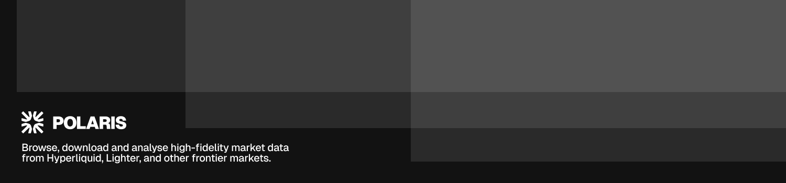
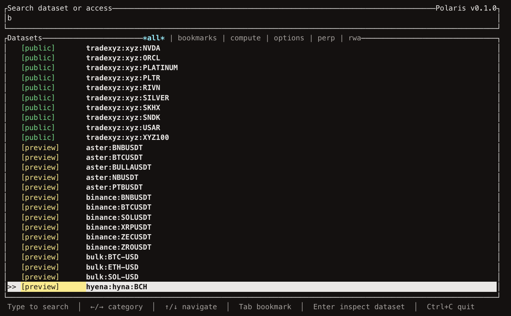

<p align="center">
  <a href="#quickstart">Quickstart</a> |
  <a href="#cli-overview">CLI Overview</a> |
  <a href="#command-reference">Command Reference</a> |
  <a href="#configuration">Configuration</a>
</p>

---

## Why Polaris

- Browse remote source and market datasets from the terminal
- Sync only the snapshot ranges you need
- Materialize full UTC-day local files automatically when a day is fully present
- Inspect the local dataset tree managed by Polaris
- Automate data workflows with plain CLI output or `--json`



## Quickstart

### 1. Install Polaris

```bash
curl -fsSL https://raw.githubusercontent.com/polaris-data/cli/main/install.sh | bash
```

Or with Homebrew:

```bash
brew tap polaris-data/tap
brew install polaris-data/tap/polaris
```

### 2. Browse via TUI

```bash
polaris
```

### 3. Browse remote datasets

```bash
polaris catalog --source hyperliquid --market BTCUSDT
```

### 4. Download one time range

```bash
polaris download \
  --source hyperliquid \
  --market BTCUSDT \
  --from 2026-06-01T00:00:00Z \
  --to 2026-06-02T00:00:00Z
```

### 5. Inspect local data

```bash
polaris list --source hyperliquid --market BTCUSDT
```

After download completes, Polaris stores the fetched snapshot files under its managed local root.

### 6. Optional: Sign in for more datasets

To sign in with the browser flow and save the returned API key locally:

```bash
polaris login
```

To enter an API key manually and save it locally:

```bash
polaris key
```

Or set it per-session:

```bash
export POLARIS_API_KEY="your_api_key"
```

Check whether Polaris sees a configured credential:

```bash
polaris account
```

## CLI Overview

```text
polaris
├── account
├── catalog
├── feedback
├── key
├── login
├── list
├── download
├── reset
└── update
```

Top-level help:

```bash
polaris --help
```

## Command Reference

### `polaris`

Opens the interactive remote dataset browser TUI in a real terminal. If no TUI can be rendered, it falls back to plain CLI output.

### `polaris login`

Starts the browser login flow, waits for approval, and stores the returned Polaris API key in persistent credential storage.

```bash
polaris login
```

### `polaris key`

Prompts securely for a Polaris API key and stores it in persistent credential storage.

```bash
polaris key
```

### `polaris account`

Prints the current Polaris auth state, credential source, and live account details when signed in.

```bash
polaris account
```

### `polaris catalog`

Lists remote datasets available from Polaris.

```bash
polaris catalog --json

polaris catalog \
  --source aster \
  --market BTCUSDT \
  --search btc \
  --limit 25
```

### `polaris feedback`

Sends product feedback to the Polaris team through the configured Polaris API.

```bash
polaris feedback "can you add parquet downloads?"
```

### `polaris list`

Lists local snapshots under the configured root.

```bash
polaris list --json
```

### `polaris download`

Downloads missing snapshots for the requested dataset and time range. Existing complete local files are reused and not downloaded again.

After download completes, the fetched snapshots are stored under `data/` within the configured local root.
```bash
polaris download \
  --source aster \
  --market BTCUSDT \
  --from 2026-06-01T00:00:00Z \
  --to 2026-06-02T00:00:00Z

polaris download \
  --source aster \
  --market BTCUSDT \
  --from 2026-06-01T00:00:00Z \
  --to 2026-06-02T00:00:00Z \
  --json \
  --concurrency 8
```

### `polaris reset`

Removes all local dataset state managed by Polaris under the configured root.

```bash
polaris reset
polaris reset --json
```

### `polaris update`

Downloads the release installer and updates the current CLI in place.

By default, `polaris update` tries to preserve the current install directory when running from an installed `polaris` binary. If it is run from a legacy `tick` binary, it preserves that legacy install directory. You can override that behavior explicitly.

```bash
polaris update
polaris update --version v0.4.2
polaris update --install-dir "$HOME/.local/bin"
```

## Configuration

### Environment variables

| Variable | Default | Purpose |
| --- | --- | --- |
| `POLARIS_BASE_URL` | `https://api.polaris.supply` | Base URL for Polaris API requests |
| `POLARIS_API_KEY` | unset | Optional bearer token for authenticated Polaris requests |
| `POLARIS_ROOT` | platform app-data directory | Override the local dataset root directory |
| `POLARIS_CONCURRENCY` | unset | Default download concurrency when `--concurrency` is not provided |
| `POLARIS_TIMEOUT_SECS` | unset | Request timeout in seconds |

`POLARIS_API_KEY` takes precedence over the stored credential saved by `polaris login` or `polaris key`.

Example:

```bash
export POLARIS_BASE_URL="https://api.polaris.supply"
export POLARIS_ROOT="$HOME/.local/share/polaris-dev"
export POLARIS_CONCURRENCY="8"
export POLARIS_TIMEOUT_SECS="60"

polaris catalog
polaris list
polaris download --source aster --market BTCUSDT --from 2026-06-01T00:00:00Z --to 2026-06-02T00:00:00Z
```

Compatibility notes:

- `TICK_ROOT`, `TICK_CONCURRENCY`, and `TICK_TIMEOUT_SECS` are still accepted
- If `POLARIS_API_KEY` is unset, Polaris also falls back to the legacy `tick` OS credential entry when needed

### JSON and automation

Use `--json` when you want structured output for scripts or agents.

Commands with `--json` support:

- `polaris catalog`
- `polaris list`
- `polaris download`
- `polaris reset`

Examples:

```bash
polaris catalog --json
polaris list --json
polaris download --source aster --market BTCUSDT --from 2026-06-01T00:00:00Z --to 2026-06-02T00:00:00Z --json
polaris reset --json
```

## Data Layout

By default, Polaris stores data under the platform app-data directory unless `POLARIS_ROOT` is set.

Default paths:

- macOS: `~/Library/Application Support/polaris`
- Linux: `$XDG_DATA_HOME/polaris` or `~/.local/share/polaris`
- Windows: `%APPDATA%\\polaris`

Within that root, Polaris owns this layout:

```text
<root>/
  data/
  tmp/
  cache/
```

- `data/` stores snapshot files fetched from Polaris
- `tmp/` stores temporary download state
- `cache/` stores local cache state used by the CLI

Compatibility note:

- If the new default Polaris root does not exist but the legacy `tick` data root does, Polaris keeps using the legacy root automatically

## Development

Useful local commands:

```bash
cargo run -- --help
cargo test
```

## Release

Polaris release assets are built by a single GitHub Actions workflow from the crate version in `Cargo.toml`.

Expected assets:

- `polaris-v{version}-x86_64-apple-darwin.tar.gz`
- `polaris-v{version}-aarch64-apple-darwin.tar.gz`
- `polaris-v{version}-x86_64-unknown-linux-gnu.tar.gz`
- `polaris-v{version}-aarch64-unknown-linux-gnu.tar.gz`
- `polaris-v{version}-checksums.txt`
